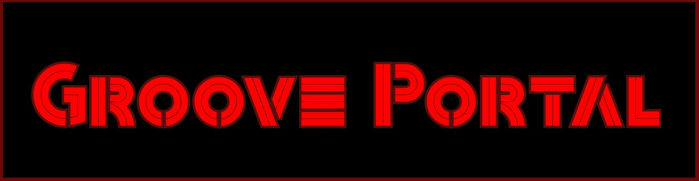
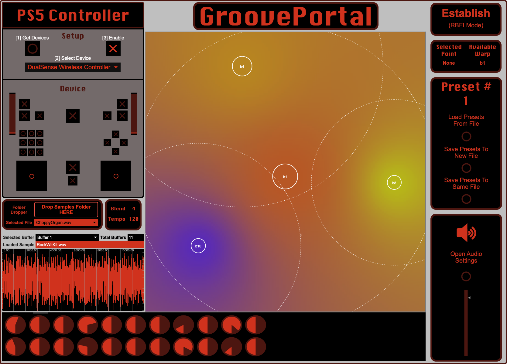
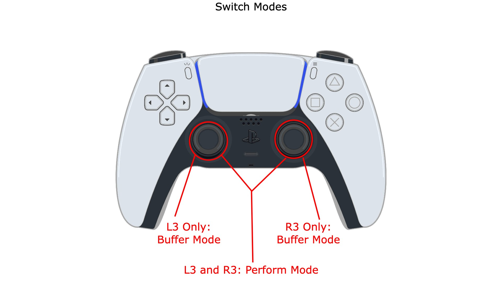
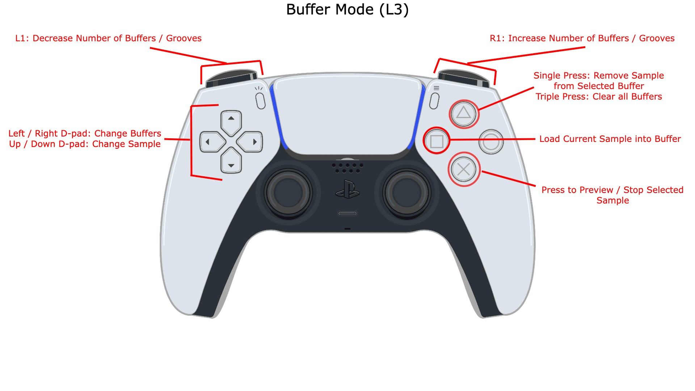
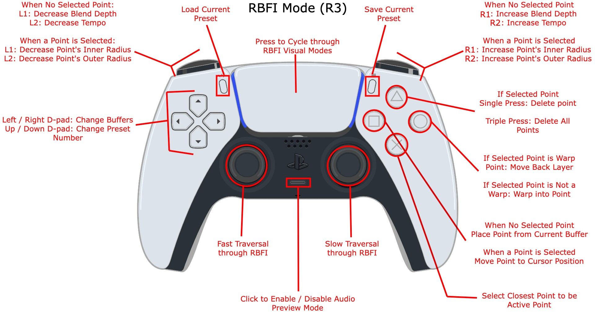
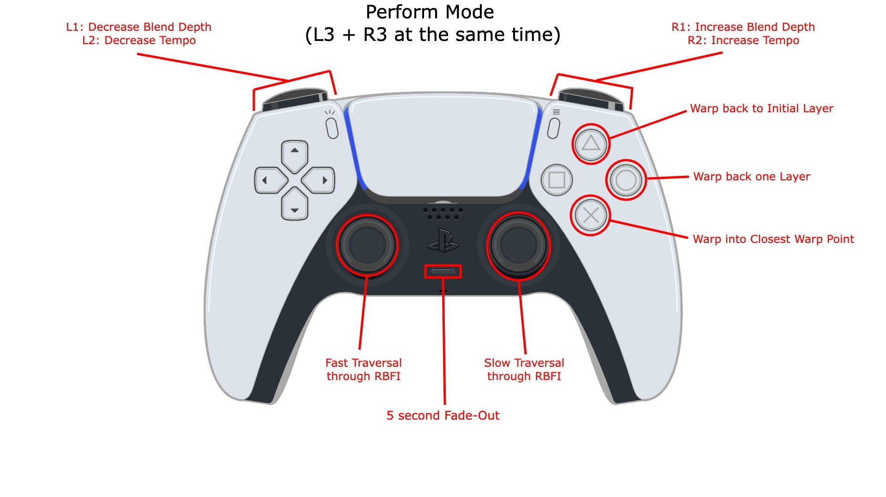

 <!-- markdownlint-disable-line -->

## Overview

Groove Portal is a flexible Multidimensional Audio Mixer intended for live performance. Explore the spatial relationship between samples as you place Audio Samples onto a multidimensional space and travel through it to blend the samples together.

GroovePortal's core features are:

- Dynamically add new buffer~ and groove~ objects to support as many samples as your computer can handle.
- Place down samples on a single Layer to create a spatial relationship between them.
- Each Sample can be "warped" into, creating a new layer that can be customized around that sample.
- Traverse the sample space to mix and blend the audio samples with respect to their spatial relationship.
- Adjust blend strength and timestretching parameters in real-time.
- Save spaces, sample placements, warping parameters, and more as presets to be recalled later.

GroovePortal is *not* an Audio / Clip editor or a DAW; there are many existing tools that perform these functions. The intention of GroovePortal is to be a live performance tool for mixing audio samples in unique ways according to a spatial relationship defined by the performer.

## How to Download

Download the GroovePortal macOS application from the [GroovePortal GitHub Releases Page](test.com).

### Requirements

A Sony PS5 DualSense controller is needed in order to control most of the functionality of GroovePortal.

If you wish to view the Max patches in the [patchers](https://github.com/gloliva/GroovePortal/tree/master/patchers) directory, it is recommended to download the Max Collective (.mxf) file from the [GroovePortal GitHub Releases Page](test.com). However, if you would like to download and view the source files, the following dependencies are required:

- [dsc.max](https://github.com/zetenynagy/dsc.max) (patches must be in Max file path)
- [CNMAT-odot](https://github.com/CNMAT/CNMAT-odot) (can be installed via Max Package Manager)

## Mechanics

### Warping, Layers, and Multidimensionality

Only one 2D plane, or "layer", is seen at a time. Points are placed on this layer to represent a horizontal and vertical relationship between these points in a 2D space. As the user moves the cursor throughout this space, the samples are blended together depending on the strength

This is the "multidimensional" component of GroovePortal, each and every point can be warped into to create another layer of samples. This can be used to create extremely deep and "skewed trees", highly dense and "balanced tree", and everything in between. It is the user who decides which points can be warped into and how many layers exist within each point depending on the relationship they are trying to represent and explore.

### Point Parameters

All points correspond to a specific buffer~ instance. These buffer objects will typically have a sample loaded into them, but do not need to if the user wishes to use a specific buffer as a "dead" or "silent" zone.

Each point's "strength" (its amplitude) is set by its inner (full line) and outer (dashed line) circles. The inner circle dictates where that sample will be favored the strongest. The outer circle determines where the sample still has some influence, with a diminishing value as the cursor moves further away from the sample center. Outside of the outer circle, the sample has little to no strength and is likely to be muted.

In RBFI mode, the user can select points and increase / decrease their inner and outer circle radii to adjust the sample's influence within the current layer.

### Sample Centers

When a sample is warped into, it becomes the Focal Point of the layer. This can be thought of as a "Sample Center", very similar the concept of "Tonal Centers" in Music Theory. Each additional sample point added to this layer has some relationship to the Sample Center, allowing the layer to have its own musical aesthetic with respect to this sample center.

### Spatial Audio

If the user has a 4-channel output setup, this functionality can be extended to support the vertical relationship between the points of each layer to affect the output of channels 3 and 4.

### Blend and Tempo Changes

## Controls

### Switch Modes

`L3` - Switch to Buffer Mode  
`R3` - Switch to RBFI Mode  
`L3 + R3` - Press both L3 and R3 at the same time to switch to Performance Mode

### Buffer Mode

`Left / Right D-pad` - Cycle through Buffers  
`Up / Down D-Pad` - Cycle through Samples

`X` - Press to Preview Current Sample **|** Press again to stop Preview  
`Square` - Load selected sample into current Buffer  
`Triangle` - Clear current Buffer (*Single Tap*) **|** Clear all Buffers (*Triple Tap*)

`L1 / R1` - Decrease / Increase Number of Buffers and Grooves

### RBFI Mode

`Left Joystick` - Fast traversal through RBFI space  
`Right Joystick` - Slow traversal through RBFI space  
`Left / Right D-pad` - Cycle through Buffers  
`Up / Down D-Pad` - Cycle through Presets

`X` - Select Point closest to Cursor for Editing **|**  If no closest Point, deselect any active Point  
`Square` - Place Point associated with current buffer (*No selected point*) **|** Move Point to Cursor Position (*Point Selected*)  
`Circle` - Warp into Point (*Point Selected*) **|** Warp out of Point (*If Point Selected has been warped into already*)  
`Triangle` - Delete all Points (*Triple Tap*) **|** Delete Selected Point (*Point Selected*)

`L1 / R1` - Decrease / Increase Blend Depth (*No selected point*) **|** Decrease / Increase Inner Radius (*Point Selected*)  
`L2 / R2` - Decrease / Increase Tempo (*No selected point*) **|** Decrease / Increase Outer Radius (*Point Selected*)

`Mute Button` - Enable / Disable Preview Mode (*Samples Play as if in Performance Mode*)  
`Trackpad` - Cycle through RBFI Visual modes  
`Media Button`  - Load Current Preset  
`Options Button` - Save to Current Preset

### Performance Mode

`Left Joystick` - Fast traversal through RBFI space  
`Right Joystick` - Slow traversal through RBFI space

`X` - Warp into Closest Point  
`Circle` - Warp Back One Layer  
`Triangle` - Warp Back to Initial Layer

`L1 / R1` - Decrease / Increase Blend Depth  
`L2 / R2` - Decrease / Increase Tempo

`Mute Button` - 5 Second Fade Out (*Useful for switching out of Performance Mode*)

## Technical Details

### Dynamic Buffers and Grooves

### RBFI Multidimensionality

### Saving and Restoring Presets

### PS5 Controller Support

## Future Ambitions

## Credits

All Max patches and Javascript files available in this GitHub repo were developed by Gregg Oliva.
