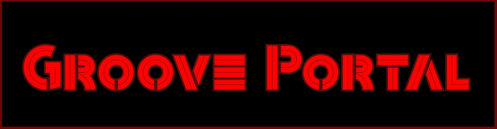
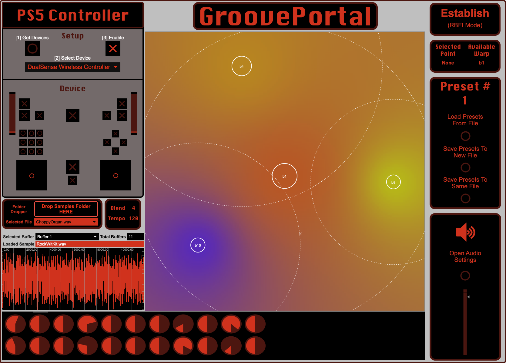
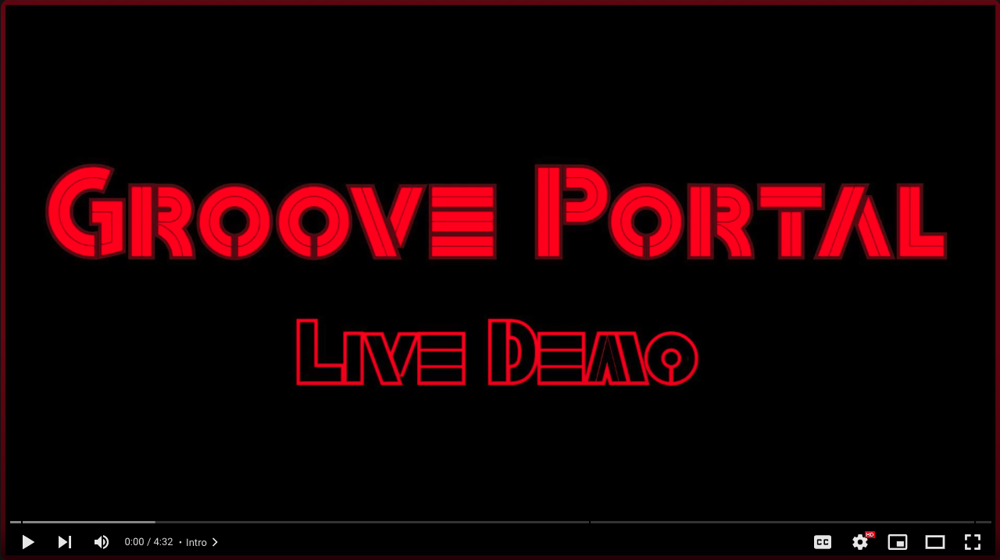
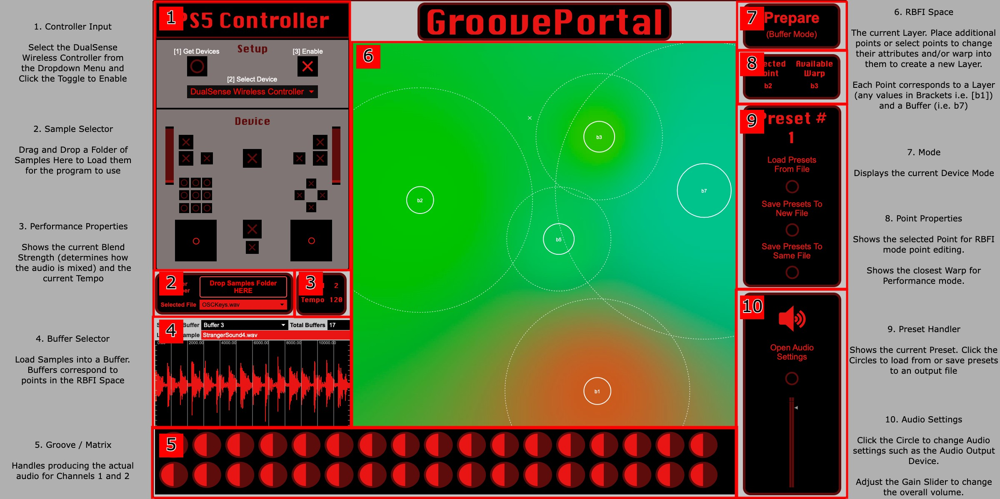
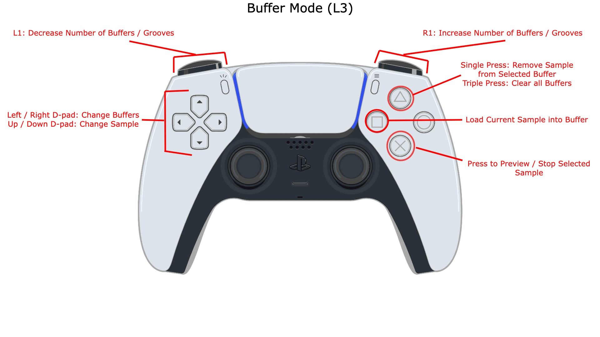
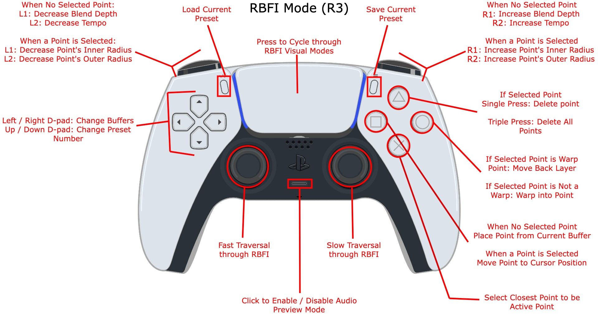
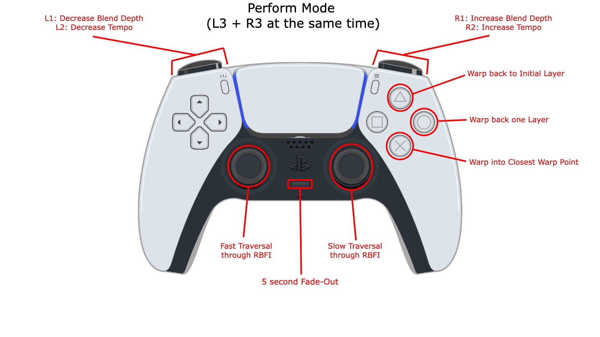
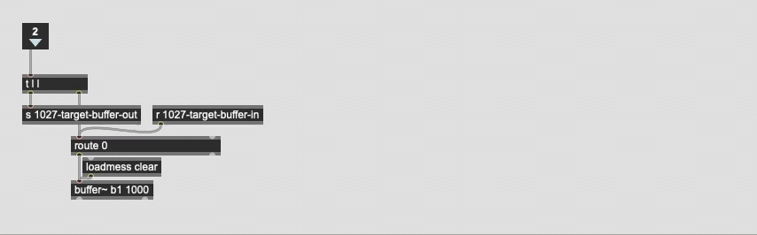
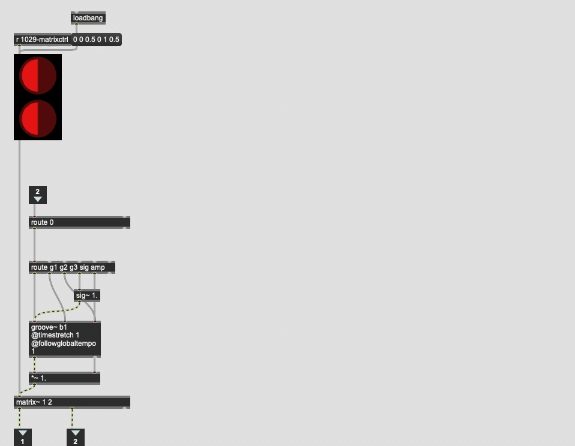
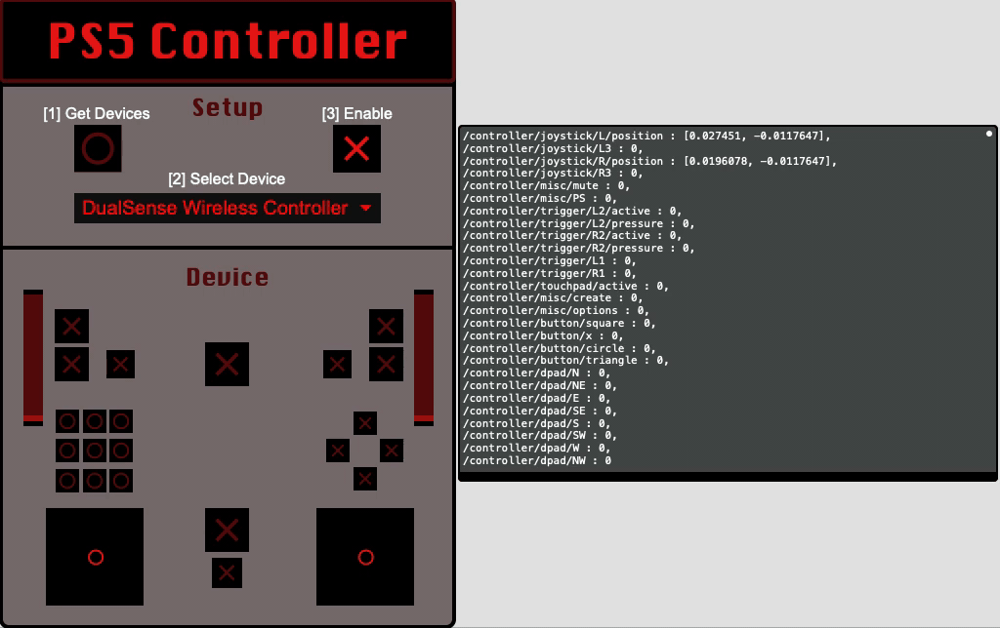

 <!-- markdownlint-disable-line -->

## Overview

Step into the world of GroovePortal, your gateway to a dynamic and immersive audio mixing experience designed for live performances. Discover a new dimension of sound manipulation as you venture into a multidimensional space, blending samples across many layers of sound.

GroovePortal offers a range of powerful features, including:

- Dynamically add new buffer~ and groove~ objects to support loading as many samples as your computer can handle.
- Creating unique Sample Spaces comprising multiple layers that can be traversed, allowing you to craft intricate spatial relationships between audio samples.
- Navigating the sample space to mix and blend audio samples based on their spatial properties.
- Adjusting blend strength and timestretching parameters in real-time.
- Saving your configurations, sample placements, portals, and more as presets for instant recall.

It's essential to note that GroovePortal is *not* an audio editor or DAW. Instead, it stands as a dedicated live performance tool, empowering artists to craft audio experiences that respond to the performer's unique spatial vision.

## Click Below to Watch a Live Demo of GroovePortal

## How to Download

Download the GroovePortal macOS application from the [GroovePortal GitHub Releases Page](test.com).

### Requirements

A Sony PS5 DualSense controller is needed in order to control most of the functionality of GroovePortal.

If you wish to view the Max patches in the [patchers](https://github.com/gloliva/GroovePortal/tree/master/patchers) directory, it is recommended to download the Max Collective (.mxf) file from the [GroovePortal GitHub Releases Page](test.com). However, if you would like to download and view the source files, the following dependencies are required:

- [dsc.max](https://github.com/zetenynagy/dsc.max) (patches must be in Max file path)
- [CNMAT-odot](https://github.com/CNMAT/CNMAT-odot) (can be installed via Max Package Manager)

## Mechanics

### Layers, Warping, and Multidimensionality

Only one 2D plane, or "layer", is visualized and explored at a time. Points are placed on this layer to represent a horizontal and vertical relationship between them. As the user moves the cursor throughout this space, the samples are blended together depending on the "strength" of the Point (see [Point Parameters](#point-parameters) below).

Each point can be "warped" into, which creates another another layer *within* the point. This point then acts as a gateway or "portal" between these two layers.

This is the multidimensional component of GroovePortal, each and every point can be warped into to create another layer of samples that is centered around the portal. This can be used to create extremely deep and "skewed trees", highly dense and "balanced trees", and everything in between. Going deeper into each point and adding additional layers increases the dimensions of the performane space.

The user decides which points can be warped into and how many layers exist within each point depending on the relationship they are trying to represent and explore.

### Point Parameters

All points correspond to a specific buffer~ instance. These buffer objects will typically have a sample loaded into them, but do not need to if the user wishes to use a specific buffer as a "dead" or "silent" zone.

Each point's strength (its amplitude) is set by its inner (full line) and outer (dashed line) circles. The inner circle dictates where that sample will be favored the strongest. The outer circle determines where the sample still has some influence, with a diminishing value as the cursor moves further away from the sample center. Outside of the outer circle, the sample has little to no strength and is likely to be muted.

In RBFI mode, the user can select points and increase / decrease their inner and outer circle radii to adjust the sample's influence within the current layer.

### Spatial Audio

As the performer moves the cursor closer to a point, the sample at that point is amplified. As the cursor moves away from that point, the sample's amplification is reduced (and ultimatley muted). This allows points to be mixed in interesting ways given the spacial relationships between them. These relationships include:

- The vertical and horizontal distance between the points in the same layer. The distance at which points are placed away from each other determines how the points interact and blend when traversing through the space.
- Additionally, as the player traverses a single layer, a point to the left of the cursor will have a stronger output from the "Left" or 1st channel, and a point to the right of the cursor will have a stronger output from the "Right" or 2nd channel. If the user has a 4-channel output setup, this functionality can be extended to support the vertical relationship between the points of each layer to affect the output of channels 3 and 4.
- The depth and dimensional distance of portals providing access to different layers. When a point is warped into, it creates a new world of sound that is spawned from that point. The portal can be thought of as the "ending" of the previous layer and the "beginning" of the new layer.

### Sample Centers

When a sample is warped into, it becomes the Focal Point of the layer. This can be thought of as a "Sample Center", very similar the concept of "Tonal Centers" in Music Theory. Each additional sample point added to this layer can be then thought to have a relationship to the Sample Center: pulling away from the center as the cursor moves outside of the center's outer circle, and resolving back to the center as the cursor moves closer, acting like the tonic of a particular key.

### Blend Modulation

The strength of the mixing or "blending" of points can be adjusted to support different performance needs.

At a Blend Strength of 1, the strength of each point's *outer circle* is maximized, so all points can be heard roughly across the whole space. This is useful if each sample is an individual track of a complete song (or section of a song), and the performer wants to focus mostly on traversing the different layers (which could correspond to changing songs or changing sections).

At a Blend Strength of 10, the strength of each point's *inner circle* is maximized, meaning that the closest point to the cursor will dominate the space. This is useful when the performer wants to transition between complete songs, such as in a DJ setting.

Blend can be adjusted between 1 and 10 to support many different types of mixing styles, and can be adjusted on the fly to change between styles within a single performance.

### Tempo Modulation

Each sample is synced to an adjustable global tempo. This tempo can be adjusted both before and during performance mode to dynamically change the performance's tempo.

## Program Layout

## Controls

### Switch Modes

`L3` - Switch to Buffer Mode  
`R3` - Switch to RBFI Mode  
`L3 + R3` - Press both L3 and R3 at the same time to switch to Performance Mode

### Buffer Mode

`Left / Right D-pad` - Cycle through Buffers  
`Up / Down D-Pad` - Cycle through Samples

`X` - Press to Preview Current Sample **|** Press again to stop Preview  
`Square` - Load selected sample into current Buffer  
`Triangle` - Clear current Buffer (*Single Tap*) **|** Clear all Buffers (*Triple Tap*)

`L1 / R1` - Decrease / Increase Number of Buffers and Grooves

### RBFI Mode

`Left Joystick` - Fast traversal through RBFI space  
`Right Joystick` - Slow traversal through RBFI space  
`Left / Right D-pad` - Cycle through Buffers  
`Up / Down D-Pad` - Cycle through Presets

`X` - Select Point closest to Cursor for Editing **|**  If no closest Point, deselect any active Point  
`Square` - Place Point associated with current buffer (*No selected point*) **|** Move Point to Cursor Position (*Point Selected*)  
`Circle` - Warp into Point (*Point Selected*) **|** Warp out of Point (*If Point Selected has been warped into already*)  
`Triangle` - Delete all Points (*Triple Tap*) **|** Delete Selected Point (*Point Selected*)

`L1 / R1` - Decrease / Increase Blend Depth (*No selected point*) **|** Decrease / Increase Inner Radius (*Point Selected*)  
`L2 / R2` - Decrease / Increase Tempo (*No selected point*) **|** Decrease / Increase Outer Radius (*Point Selected*)

`Mute Button` - Enable / Disable Preview Mode (*Samples Play as if in Performance Mode*)  
`Trackpad` - Cycle through RBFI Visual modes  
`Media Button`  - Load Current Preset  
`Options Button` - Save to Current Preset

### Performance Mode

`Left Joystick` - Fast traversal through RBFI space  
`Right Joystick` - Slow traversal through RBFI space

`X` - Warp into Closest Point  
`Circle` - Warp Back One Layer  
`Triangle` - Warp Back to Initial Layer

`L1 / R1` - Decrease / Increase Blend Depth  
`L2 / R2` - Decrease / Increase Tempo

`Mute Button` - 5 Second Fade Out (*Useful for switching out of Performance Mode*)

## Technical Details

### Dynamic Buffers and Grooves

In a typical Max program, `buffer~` and `groove~` objects are placed manually and therefore have a set limit to how many audio files can be used at one time. The [dynamic.buffer~](https://github.com/gloliva/GroovePortal/blob/master/patchers/dynamic.buffer~.maxpat) and [dynamic.groove~](https://github.com/gloliva/GroovePortal/blob/master/patchers/dynamic.groove~.maxpat) abstractions were built to support theoretically unlimited `buffer~` and `groove~` objects (with the true limit being as many as Max / your computer can handle).

These abstractions make use of Max scripting to dynamically create the `buffer~` and `groove~` objects, as well as any additional objects needed to access or manipulate these objects (such as `route` or `*~` objects). The [dynamicbuffer.js](https://github.com/gloliva/GroovePortal/blob/master/js/dynamicbuffer.js) and [dynamicgroove.js](https://github.com/gloliva/GroovePortal/blob/master/js/dynamicgroove.js) Javascript files handle creating the scripting messages to create the `buffer~` and `groove~` objects, resize or recreate other helper objects, and then route them all together, passing out these messages to a `thispatcher` object.

**Dynamically Change Number of Buffers:**  

**Dynamically Change Number of Grooves:**  

### Adding Points and Warping

GroovePortal uses the CNMAT Externals `rbfi` object for placing points on a layer and interpolating between them. The `rbfi` object has experimental features `push` and `pop` which adds or removes layers, and is the core functionality for implementing warping. Output from the `controller.ps5` is processed and converted into `rbfi` messages in order to add, remove, adjust, and warp into and out of points in a layer.

The `rbfi` object requires points to have unique names, so to prevent name collisions the layer identifier is added as a prefix to each point name, allowing a single buffer to be placed on every layer if desired. The base plane's layer identifier is an empty string, so points on that layer will be named directly after the buffer, i.e. `b1` for Buffer1 or `b7` for Buffer7. If a point is warped into, the layer identifier is the portal's name between brackets, for example `[b7]`. Any point added to this layer will be prefixed by this identifier, so placing down a point associated with Buffer2 will be named `[b7]b2`, and so on.

**Add Points and Warps:**  

### Saving and Restoring Presets

GroovePortal can save all useful information into a Preset to later be recalled: all point placements and properties, performance properties, warps and layers, audio files and buffer configurations can be saved. The application even remembers which files were loaded into which buffers and reloads them for you when recalled.

This is done through a combinantion of Pattr and Coll storage. Multiple `coll` objects are used to save information such as available warps and which audio files map to which buffers. By default, however, `coll` objects do not work with `pattr` or `autopattr` objects. In order to avoid having to manage multiple output files to save program states, custom logic has been implemented to support saving `coll` output with the Pattr system. When a preset is saved, each `coll` object dumps their contents to a Max message which is saved via Pattr. When a preset is loaded, this message is restored via Pattr and then parsed into a format that can be reloaded into `coll`. This allows all relevant data to be saved via a single storage method, making saving and loading presets extremely simple from the user perspective.

**Loading Two Different Presets:**  

### PS5 Controller Support

The [controller.ps5](https://github.com/gloliva/GroovePortal/blob/master/patchers/controller.ps5.maxpat) abstraction is a visual wrapper around the [dsc.ds5.usb](https://github.com/zetenynagy/dsc.max/blob/main/dsc.ds5.usb.maxpat) object, which in turn is just a wrapper around the `hi` object. The `controller.ps5` object provides a visual representation for the actions of the performer, and packages the output up as an OSC bundle for easy use across the patch.

**Overview of Controller:**  

## Future Ambitions

## Credits

All Max patches and Javascript files available in this GitHub repo were developed by Gregg Oliva.
